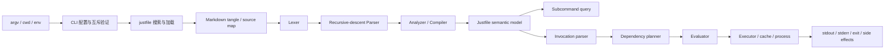

# MoonJust 项目实施计划

> 文档状态：已接受执行基线 v1.0
> 编制日期：2026-08-04
> 最近严格复核：2026-08-07；实现与证据受审基线为 `main@dfaf5b9ec4a0b05f8b2b8094213087c3b2e74313`。后续仅发布或校正文档的提交不改变该受审实现基线；Phase 0-5 结论见 [`PHASE_0_5_AUDIT.md`](PHASE_0_5_AUDIT.md)。
> 外部 CI 例外恢复：2026-08-07 GitHub Actions 已恢复 operational，本次变更恢复完整 Ubuntu/macOS/Windows smoke。恢复 PR 与合并后 `main` 的四项检查全部通过前，原例外仍视为未关闭；详见 [`PHASE_0_5_AUDIT.md`](PHASE_0_5_AUDIT.md)。
> 目标产品：用 MoonBit 实现与 `just` 基本兼容的跨平台命令运行器
> 上游兼容基线：`casey/just` `1.57.0`，提交 `e01a6bd7e7a30baf86bc86d2b95b0998ebbdc36f`
> 必须支持的 MoonBit 目标：`native`、`wasm`（wasm1，由 `moonx`/`moonrun` 承载）
> 明确排除：shell completion 的生成、脚本和兼容性实现

本文件是项目在进入功能开发前的范围、架构、兼容、质量和发布单一事实源。任何改变兼容范围、主机能力模型、公开 API、依赖策略、发布门禁或安全边界的 PR，都必须同步修改本文件或关联 ADR。

## 1. 执行摘要

MoonJust 不是对上游 Rust 源码逐文件机械翻译，而是对 `just` 用户可观察行为的 MoonBit 重实现。验收对象包括 justfile 语法和语义、命令行行为、进程与文件系统副作用、输出和退出码，以及支持平台上的差异行为。上游内部 Rust API 不属于兼容承诺。

项目采用“纯核心 + 显式主机能力 + 多后端适配器”架构：词法、语法、分析、求值、依赖图和执行计划保持纯 MoonBit；文件系统、环境、时钟、随机数、终端、信号和进程通过项目自有的能力接口进入；`native` 与 `wasm` 分别提供适配器。这样可以避免实验性生态包扩散到核心，并使无进程能力的 Wasm 环境仍能使用解析、格式化和检查 API。

`wasm` 的首要运行环境明确为 MoonBit 的 `moonx`/`moonrun` 宿主，而不是浏览器或任意 WASI 运行时。执行 recipe 需要宿主提供文件系统、环境和子进程能力。浏览器、通用 WASI 和 `wasm-gc` 只作为未来可选目标，不计入首发承诺。

依赖策略是“标准库优先、官方包次之、成熟社区包需经过契约测试、兼容关键路径自研”。`moonbitlang/async` 可作为主机 I/O 与进程的候选实现，但必须被封装在适配层并锁定版本；BLAKE3、SemVer requirement、dotenv 和 just 特有路径/引用/输出行为没有足够成熟且完全匹配的跨目标包，计划自研并用上游差分测试约束。

按当前上游规模，达到可上线的 1.0 不是短期翻译任务。本项目由独立维护者开发，按关键路径串行推进，并只在依赖已冻结时穿插互不阻塞的验证工作。项目不以人员规模或日期估算替代兼容测试覆盖率和阶段出口。

## 2. 已核实基线

### 2.1 本地仓库

- 工作目录：`/Users/winter/Documents/Moonbit/MoonJust`。
- 模块名：`moonbit-community/MoonJust`，当前版本 `0.1.0`，许可证 `Apache-2.0`。
- 当前首选目标：`wasm`。
- Phase 0-2 已建立治理与兼容基线、`cmd/just` smoke、Native/wasm1 测试、差分 harness、Source/Span/Host 契约和完整 justfile lexer。
- Phase 3-5 已于 2026-08-06 完成严格 remediation 并恢复为通过；逐项证据、目标矩阵和机器门禁见各阶段报告及 [`PHASE_0_5_AUDIT.md`](PHASE_0_5_AUDIT.md)。
- pre-commit 与 GitHub Actions 共用 `tools/check.sh` 的确定性质量门禁，并增加三平台 Native smoke。
- 工作目录 `/Users/winter/Documents/Moonbit/MoonJust` 是独立 Git 仓库，远程为 `moonbit-community/MoonJust`。

### 2.2 工具链

调查时工具链为 `moon 0.1.20260803 (c19f78e 2026-08-03)`。空项目基线结果：

- `moon check --target all`：通过。
- `moon test --target native`：通过，0 个测试。
- `moon test --target wasm`：通过，0 个测试。
- `moon test --target wasm-gc`：通过，0 个测试。
- `moon test --target js`：通过，0 个测试。
- `moon fmt --check`：未通过；当前模板的空 `moon.pkg` 和 `moon.mod` 中 `keywords = []` 不符合现用 formatter 输出。这是 PR-001 必须清理的基线问题。
- `moonx` 已安装，公开支持 `--target wasm` 和 `--target native`。
- `moonrun` 使用 TOML policy 控制 Wasm 对文件系统、网络、环境和进程的访问。

基线通过只证明工程骨架可编译，不表示任何功能已经实现。

### 2.3 上游 `just`

计划锁定 `1.57.0` 作为首个兼容基线，不跟随 `main` 浮动开发。调查快照：

- 发布日期：2026-07-19。
- 精确提交：`e01a6bd7e7a30baf86bc86d2b95b0998ebbdc36f`。
- 上游许可证：`CC0-1.0`。
- `src/` 约 27,949 行 Rust。
- `src/`、`tests/`、`crates/` 合计约 64,712 行 Rust。
- `cargo test -- --list` 枚举出 2,417 个测试注册项。
- 复杂度集中于 parser、lexer、justfile/config/error/subcommand、function、evaluator、analyzer 和 invocation parser。
- 上游主要产品是 CLI；其 Rust library API 明确不适合作为 MoonJust 的稳定 API 基线。

所有移植的 fixture、期望输出或算法出处都必须在 `tests/upstream/NOTICE.md` 记录上游 tag、提交、原路径、许可证与必要修改。项目名称、文档和发行物必须声明与上游作者无隶属或官方背书关系。

## 3. 目标、非目标与成功标准

### 3.1 产品目标

1. 在受支持的 Native 平台上，运行处于本计划范围内的稳定 justfile 时，与上游 `just 1.57.0` 产生等价结果。
2. 提供可由 `moonx` 直接运行的 wasm1 可执行包，在 MoonBit 宿主能力允许时支持查找、检查、列举和执行 recipe。
3. 提供目标无关的 MoonBit 库 API，用于解析、格式化、分析、查询和构建执行计划。
4. 以差分测试而不是主观样例证明兼容性，并发布机器可读的兼容清单。
5. 在 Linux、macOS 和 Windows 上建立可重复构建、测试、签名和发布流程。
6. 对不支持或尚未达到一致性的能力返回稳定、可诊断的错误，绝不静默降级或产生错误副作用。

### 3.2 明确非目标

- 不实现或维护 shell completion，包括 `--completions` 生成器及各 shell 脚本。
- 不兼容上游 Rust crate 的内部类型、模块边界或 library API。
- 首发不承诺浏览器内执行 recipe、通用 WASI 运行时兼容或 `wasm-gc` 执行支持。
- 首发不承诺加载任意原生插件或执行用户注入的 MoonBit 代码。
- 不在兼容工作中顺带设计新 justfile 语言；MoonJust 扩展必须在 1.0 后、加命名空间且默认关闭。
- 不把 `changelog`、`man`、隐藏的 `request` 等上游发布维护子命令视为核心兼容能力。
- 不以“能解析几个示例”或“能跑 Happy Path”作为可上线标准。

### 3.3 1.0 成功标准

1. 兼容矩阵中 Tier A 的全部条目完成，且所有适用的上游基线用例在对应平台通过。
2. 所有未支持条目都在机器可读清单、用户文档和 CLI 诊断中一致披露。
3. `native` 在 Linux x86_64/aarch64、macOS x86_64/arm64、Windows x86_64 的 CI 或真实 runner 上通过发布门禁；若 MoonBit 工具链不支持某个组合，必须在 RC 前收缩支持声明，不能使用模拟结果代替。
4. `wasm` 在 `moonrun` 和安装前/发布后的 `moonx` 路径通过 Tier W 门禁。
5. 不存在开放的 P0/P1 缺陷、已知命令注入、越界文件访问、未说明的兼容数据损坏或非确定性死锁。
6. 解析、分析、求值和依赖调度核心包的行覆盖率不低于 90%；主机适配层不低于 80%。无法由 MoonBit 覆盖工具准确采集的路径必须以端到端用例补齐并记录豁免。
7. 公开 API 经过一次 beta 冻结；`.mbti` 差异已审查；所有公开声明都有 `///` 文档与黑盒测试。
8. 发布物包含版本、兼容基线、许可证、变更日志、校验和、SBOM 和可验证构建来源。

## 4. 兼容性定义

### 4.1 兼容的观察面

兼容性按以下六个观察面判定：

| 观察面 | 必须比较的内容 | 默认判定 |
| --- | --- | --- |
| 语言 | token、AST 含义、设置、属性、表达式、依赖和模块 | 同一输入接受或拒绝，语义一致 |
| CLI | 参数、默认值、互斥、子命令、工作目录、搜索规则 | 行为与退出码一致 |
| 输出 | stdout/stderr、顺序、换行、颜色开关、诊断位置 | 除批准的归一化项外字节一致 |
| 副作用 | 创建/读取/写入的文件，cwd、env、启动的命令 | 操作集合、顺序和失败语义一致 |
| 调度 | 依赖顺序、并行上限、失败传播、缓存命中 | 可观察行为一致 |
| 平台 | shell、路径、权限、信号、终端、Windows 特例 | 在同一受支持平台一致 |

允许归一化的内容必须列入 `tests/differential/normalizers.mbt` 的白名单，包括临时目录根、PID、墙钟时间、随机 UUID 和平台固有路径分隔符。禁止用宽泛正则删除整行错误、任意路径或命令输出。

### 4.2 兼容等级

| 等级 | 含义 | 1.0 要求 |
| --- | --- | --- |
| Tier A | 稳定核心行为，Native 发布阻断 | 全部完成 |
| Tier B | 稳定但交互性强、平台边缘或使用率较低的行为 | 必须有明确状态；关键项完成，其余可作为已知差异 |
| Tier W | wasm1 + MoonBit 宿主的可承诺子集 | 全部完成 |
| Tier X | 明确排除或上游实验性行为 | 不阻断，但必须识别并稳定报错 |

### 4.3 Tier A 范围

- justfile 向上查找、显式路径、工作目录和标准文件名规则。
- assignment、export、alias、recipe、dependency、parameter、variadic parameter、default recipe。
- import、module、submodule 和 fallback 语义。
- string、interpolation、concatenation、list、条件、逻辑和比较表达式。
- 稳定 settings 与 attributes；具体清单见第 6 节。
- recipe line、静默/忽略失败前缀、单行 shell、shebang/script recipe。
- backtick/command substitution、环境导出、dotenv、工作目录。
- `--check`、`--fmt`、`--dump`、`--evaluate`、`--list`、`--show`、`--summary`、`--usage`、`--variables`、`--groups`、`--init`、`--json` 及默认执行路径。
- `--dry-run`、`--quiet`、`--verbose`、`--jobs`、`--shell`、`--shell-arg`、`--set`、`--working-directory`、`--justfile`、颜色和排序相关稳定选项。
- recipe 依赖图、参数传播、循环检测、失败传播、并行限制。
- 稳定的内建函数，包括文件、环境、路径、哈希、正则、SemVer、UUID 和平台查询。
- Native 上的 cache、文件输入输出判断和并发互斥。

### 4.4 Tier B 范围

- `choose`、交互确认、编辑器启动、TTY 探测和富终端显示。
- Unix/Windows 信号名称、信号转发和中断时序的完全一致。
- Cygwin 路径转换、PowerShell 细节、可执行位和 shebang 的罕见平台边界。
- 本地时区、locale、Unicode 显示宽度和终端样式的全部细节。
- Markdown justfile 中非常规 CommonMark 嵌套、扩展和恶意输入。
- `--time`、`--timestamp` 等依赖墙钟且输出敏感的选项。
- 上游很少使用且不影响 recipe 执行的维护型子命令。

Tier B 不是“可忽略”。每项必须在 RC 前选择“完成”“已知差异”或“转为 Tier X”，并经 ADR 审批。

### 4.5 Tier W 范围

Wasm 目标拆为两个层次：

1. **纯库层**：解析、格式化、检查、分析、查询、JSON/dump 输出、构建执行计划。该层不得依赖文件系统或进程，可由调用方传入源文本和上下文。
2. **宿主 CLI 层**：由 `moonx`/`moonrun` 提供文件系统、环境、时钟、随机数和子进程能力。支持 justfile 查找和 recipe 执行，但受 policy 和 MoonBit Wasm runtime 能力限制。

Tier W 必须完成：

- `moonx ... --check/--fmt/--list/--show/--summary/--evaluate/--dump/--json`。
- 在明确授权的 policy 下查找和读取 justfile、dotenv、import/module。
- 在允许 `process.spawn` 时执行 shell 和 script recipe，正确传递 stdin/stdout/stderr、cwd、env 和退出码。
- 在能力缺失时返回 `CapabilityDenied` 或 `CapabilityUnavailable`，并指出需要的 policy，不伪装成 recipe 失败。
- 提供最小只读 policy 和执行 policy 示例。

不承诺浏览器 recipe 执行、原生信号完全等价、任意外部 runtime、`wasm-gc` 子进程和 JS 目标 CLI。

### 4.6 差异管理

每一个已知差异都必须有：

- 唯一 ID，例如 `MJ-COMPAT-0042`。
- 上游版本和复现 justfile/命令。
- 受影响目标和平台。
- 观察差异、风险等级、临时诊断。
- 跟踪 issue、计划修复版本或永久排除 ADR。
- 对应差分测试；永久排除也要有“预期不支持”测试。

兼容数据存入 `compat/just-1.57.0.toml`，文档由脚本生成，禁止手工维护两份不同状态。

## 5. 上游架构和端到端数据流

上游行为可抽象为：



关键结论：

- Lexer 处理缩进、dedent、recipe line 和 interpolation，不能用通用 parser combinator 草率替代。
- Grammar 是带上下文的递归下降语法，需要把 source span、缩进状态和 recipe body 模式保留为显式状态。
- Analyzer 负责名称、重复定义、依赖、设置冲突、属性和模块语义；不能把所有错误推迟到执行期。
- Evaluator 的纯表达式和有主机副作用的函数必须分层，否则 Wasm 与测试会难以控制。
- Invocation parser 与全局 CLI parser 是不同问题：前者解析 recipe 参数、属性定义的 flags 和 variadic 参数。
- Executor 必须处理 shell/script、工作目录、环境、并行、信号、失败、缓存和输出序列，不能直接散落调用 `spawn`。

## 6. 功能盘点与范围矩阵

### 6.1 语法项

| 语法族 | 示例能力 | 等级 | 实现策略 |
| --- | --- | --- | --- |
| assignment | `x := expr`、lazy/export | A | 自研 AST、分析和求值 |
| alias | recipe 别名 | A | 分析期解析并检测环 |
| recipe | 参数、body、doc、attributes | A | 自研 parser 和语义模型 |
| dependency | prior/subsequent、参数化依赖 | A | 有序 DAG，不依赖 Map 迭代顺序 |
| import/module | 相对路径、optional、submodule | A | Loader 能力 + 加载图和循环诊断 |
| settings | `set ...` | A | typed settings，分析期冲突检查 |
| expressions | string/list/if/logical/comparison/call | A | 纯 evaluator + capability functions |
| interpolation | `{{ ... }}` | A | 保留 byte span 与转义规则 |
| recipe lines | `@`、`-`、缩进、continuation | A | Lexer 专用状态机 |
| script recipe | shebang、`[script]` | A | planner 生成临时脚本描述，host 执行 |
| Markdown tangle | fenced `just` code block | B，常规用法升 A | 优先契约验证 `cmark`，否则专用实现 |
| unstable syntax | 上游 `set unstable` 后能力 | X | 识别并报“基线未支持”，逐项提升 |

### 6.2 Settings

以下 `1.57.0` settings 均进入登记表：

`allow-duplicate-recipes`、`allow-duplicate-variables`、`default-list`、`default-script`、`dotenv-command`、`dotenv-filename`、`dotenv-load`、`dotenv-override`、`dotenv-path`、`dotenv-required`、`export`、`fallback`、`guards`、`ignore-comments`、`indentation`、`lazy`、`lists`、`minimum-version`、`no-cd`、`no-exit-message`、`positional-arguments`、`quiet`、`script-interpreter`、`shell`、`tempdir`、`unstable`、`windows-powershell`、`windows-shell`、`working-directory`。

规则：

- 除 `unstable` 所开启的具体实验行为外，稳定 settings 为 Tier A。
- `windows-powershell`、`windows-shell` 的 Native Windows 行为为 Tier A，其他平台的诊断也必须一致。
- settings 冲突在分析期报告，例如 `dotenv-command` 与 filename/path/load/required、`no-cd` 与 `working-directory`。
- 不使用无类型字符串表把验证推迟到运行时。

### 6.3 Attributes

登记范围：

`android`、`arg`、`cache`、`confirm`、`continue`、`default`、`doc`、`dragonfly`、`env`、`exit-message`、`extension`、`freebsd`、`group`、`linux`、`macos`、`metadata`、`netbsd`、`no-cd`、`no-exit-message`、`no-quiet`、`openbsd`、`parallel`、`positional-arguments`、`private`、`script`、`shell`、`unix`、`windows`、`working-directory`。

其中：

- 平台 enable attributes、`default/doc/group/private/no-cd/working-directory` 为 Tier A。
- `arg` 的 short/long/default/pattern/min/max/multiple 进入 invocation parser 专项测试。
- `cache`、`parallel` 为 Tier A，但在调度和缓存阶段实现。
- `confirm` 为 Tier B；非交互环境必须稳定失败或受 `--yes` 控制。
- BSD/Android 等无法进入常规 CI 的平台属性先验证选择逻辑，真实执行支持取决于发布平台声明。

### 6.4 内建函数分类

| 类别 | 代表函数 | 等级 | 设计 |
| --- | --- | --- | --- |
| 纯字符串 | append/prepend、case conversion、replace、trim、quote | A | 自研，差分 corpus |
| 纯列表/数值 | len、join、choose、列表构造 | A | 自研 |
| 路径计算 | clean、extension、file_name、parent、without_extension | A | 项目 PathModel，显式 Unix/Windows flavor |
| 平台查询 | arch、os、os_family、num_cpus、jobs | A | HostInfo 快照 |
| 环境/目录 | env、env_var、home/cache/config/data dir | A | HostEnv，错误可区分 |
| 文件 | read、path_exists、canonicalize、which | A | HostFs，不直接调用生态 API |
| 哈希 | sha256、sha256_file、blake3、blake3_file | A | SHA-256 可适配官方包；BLAKE3 自研纯 MoonBit |
| 正则 | regex_match、regex_replace | A | `moonbitlang/regexp` 契约层 |
| SemVer | semver_matches | A | 自研所需 parser/range matcher |
| 时间 | datetime、datetime_utc | A Native，W 条件支持 | HostClock + 受控 formatter/timezone |
| 随机 | uuid | A | RFC 4122 v4，自研格式化 + HostRandom |
| 命令 | shell | A | EffectEvaluator 经 HostProcess |
| just 上下文 | justfile/dir/executable/pid/version、recipe/module 信息 | A | EvaluationContext 快照 |
| 终止 | error、require | A | typed EvalError，不用字符串异常 |

用户可见的 `blake3()` 绝不能用 SHA-256 替代。内部 cache digest 可以在格式版本化的前提下选择算法，但首选复用完成验证的 BLAKE3。

`function.rs` 在 `1.57.0` 注册的 83 个规范函数名完整清单如下，全部必须进入 `compat/builtins.toml`：

`absolute_path`、`append`、`arch`、`blake3`、`blake3_file`、`bool`、`cache_directory`、`canonicalize`、`capitalize`、`choose`、`clean`、`config_directory`、`config_local_directory`、`data_directory`、`data_local_directory`、`datetime`、`datetime_utc`、`encode_uri_component`、`env`、`env_var`、`env_var_or_default`、`error`、`executable_directory`、`extension`、`file_name`、`file_stem`、`home_directory`、`invocation_directory`、`invocation_directory_native`、`is_dependency`、`join`、`join_list`、`just_executable`、`just_pid`、`just_version`、`justfile`、`justfile_directory`、`kebabcase`、`len`、`lowercamelcase`、`lowercase`、`module_directory`、`module_file`、`module_path`、`num_cpus`、`num_jobs`、`os`、`os_family`、`parent_directory`、`path_exists`、`prepend`、`quote`、`read`、`recipe_name`、`replace`、`replace_regex`、`require`、`runtime_directory`、`semver_matches`、`sha256`、`sha256_file`、`shell`、`shoutykebabcase`、`shoutysnakecase`、`show`、`snakecase`、`source_directory`、`source_file`、`split`、`style`、`titlecase`、`trim`、`trim_end`、`trim_end_match`、`trim_end_matches`、`trim_start`、`trim_start_match`、`trim_start_matches`、`uppercamelcase`、`uppercase`、`uuid`、`which`、`without_extension`。

上游还把以 `_dir` 结尾的调用映射到对应 `_directory` 函数，并把 `_dir_native` 映射到 `_directory_native`。这些兼容别名必须由注册表统一生成和测试，不能散落在 evaluator 分支中。

### 6.5 CLI 子命令和选项

子命令处理优先级：

| 子命令 | 等级 | 说明 |
| --- | --- | --- |
| 默认执行、`command` | A | 主要产品路径 |
| `check`、`fmt` | A | 首批可交付能力 |
| `dump`、`evaluate`、`json` | A | 核心可查询性和差分调试 |
| `list`、`show`、`summary`、`usage`、`variables`、`groups` | A | 日常发现能力 |
| `init` | A | 防覆盖和模板内容需一致 |
| `clean` | A | 与 cache 一起交付 |
| `choose`、`edit` | B | 依赖 TTY/editor host capability |
| `changelog`、`man` | X | 发布维护功能，不属于核心 |
| `request` | X | 上游隐藏/维护接口 |
| `completions` | X | 用户明确排除；不生成 completion |

`just 1.57.0 --help` 暴露的全局选项必须全部登记，当前基线清单如下：

| 选项族 | 基线选项 | 默认等级 |
| --- | --- | --- |
| 搜索和加载 | `--allow-missing`、`--ceiling`、`--global-justfile`、`--justfile/-f`、`--justfile-name`、`--working-directory/-d` | A |
| dotenv 和环境 | `--dotenv-command`、`--dotenv-filename/-F`、`--dotenv-path/-E`、`--no-dotenv`、`--set` | A |
| 执行 | `--clear-shell-args`、`--dry-run/-n`、`--jobs`、`--no-cache`、`--no-deps`/`--no-dependencies`、`--one`、`--shell`、`--shell-arg`、`--shell-command`、`--tempdir`、`--yes` | A |
| 输出和诊断 | `--color`、`--command-color`、`--explain`、`--highlight`、`--no-highlight`、`--quiet/-q`、`--time`、`--timestamp`、`--timestamp-format`、`--verbose/-v` | A；时间和终端精确表现为 B |
| list/show 格式 | `--alias-style`、`--default-list`、`--group`、`--indentation`、`--list-heading`、`--list-prefix`、`--list-submodules`、`--no-aliases`、`--unsorted/-u` | A |
| 输出格式 | `--dump-format`、`--evaluate-format` | A |
| 平台 | `--cygpath` | B；Windows/Cygwin 上完成后升 A |
| 实验能力 | `--unstable` | X；flag 可识别，具体功能逐项登记 |
| completion 相关 | `--complete-aliases` | X；随 completion 一并排除 |
| 自描述 | `--help/-h`、`--version/-V` | A |

`just 1.57.0` 的 command 入口完整清单为：`--changelog`、`--choose`、`--clean`、`--command/-c`、`--completions`、`--dump`、`--edit/-e`、`--evaluate`、`--fmt`、`--groups`、`--init`、`--json`、`--list/-l`、`--man`、`--show/-s`、`--summary`、`--usage`、`--variables`。上游把这些显示在 help 的 `Commands` 区域，但调用形式仍是带 `--` 的选项；差分 harness 必须使用真实 argv，不把它们误实现成裸 subcommand。

关键约束也属于兼容面，例如 `--check` requires `--fmt`、`--group` requires `--list`、`--working-directory` requires `--justfile`，以及 `--dry-run` 与 `--quiet` 冲突。PR-060 必须从 `arguments.rs` 自动或表驱动地登记全部 requires/conflicts/overrides/default/env 关系，并对错误退出码和 stderr 做差分。

CLI 的全部稳定全局 flags 都必须进入 `compat/cli-options.toml`，即使尚未实现。未实现 flag 应在解析后给出稳定的 unsupported 诊断和退出码 2，禁止被忽略。

### 6.6 文件发现和加载

- 建立大小写和平台敏感的候选文件名顺序，覆盖 `justfile`、`.justfile` 和支持的大小写形式。
- 明确向父目录搜索的终止条件、ceiling、工作目录和显式 `--justfile` 行为。
- `--global-justfile`、stdin、Markdown justfile 和 module/import 使用同一个 SourceLoader，来源带稳定 ID。
- 加载图记录 canonical path，但诊断显示用户输入路径；避免 symlink 导致重复加载和循环绕过。
- 任何自动创建临时文件都经过 HostTemp，退出、取消和异常时清理。

## 7. MoonBit 适配设计

### 7.1 包结构

建议目标结构如下；每个目录是独立 MoonBit package，避免单一巨型包：

```text
MoonJust/
├── moon.mod
├── moon.pkg
├── cmd/
│   └── just/                 # 唯一 CLI composition root
├── src/
│   ├── api/                  # 稳定 facade，公开 Parse/Check/Format/Plan API
│   ├── source/               # UTF-8 bytes、SourceId、Span、line index
│   ├── diagnostic/           # typed diagnostics 与 renderer
│   ├── lexer/                # token 与缩进/recipe 状态机
│   ├── syntax/               # AST/CST 与语法公共类型
│   ├── parser/               # 递归下降 parser
│   ├── formatter/            # CST/AST 驱动格式化和 diff
│   ├── semantic/             # settings、attributes、符号和静态检查
│   ├── loader/               # import/module/source graph
│   ├── value/                # 表达式值与纯操作
│   ├── evaluator/            # pure/effect evaluation split
│   ├── builtin/              # 内建注册表及分类
│   ├── invocation/           # recipe 参数和 flags
│   ├── planner/              # 有序 DAG、失败传播、cache key
│   ├── runtime/              # executor 状态机，不含目标 FFI
│   ├── host/                 # 项目拥有的 capability contract
│   ├── host_native/          # native adapter
│   ├── host_wasm/            # moonrun/moonx wasm adapter
│   ├── cli/                  # argv 到 ApplicationRequest
│   └── crypto_blake3/        # 隔离的纯 MoonBit 实现
├── compat/                   # 机器可读兼容清单
├── tests/
│   ├── fixtures/
│   ├── upstream/
│   ├── differential/
│   ├── platform/
│   └── security/
├── bench/
├── policies/                 # moonrun policy 示例
├── docs/
└── tools/                    # fixture/compat 生成和验证工具
```

当前 `cmd/main` 在 PR-001 中替换为 `cmd/just`。产品品牌为 MoonJust，兼容入口名建议为 `just`，Mooncakes 坐标建议为 `ZSeanYves/MoonJust/cmd/just`；最终发布账号和命名须由 ADR-001 冻结。不要维护两个行为可能分叉的 CLI 入口。

### 7.2 源文本、Unicode 和 Span

Rust 上游的 source offset 基于 UTF-8 byte。MoonBit `String` 的索引模型不能被假定与 Rust byte offset 相同，因此：

- Source 原始表示使用 UTF-8 `Bytes`，先验证编码，再构建 line index。
- `Span` 存储 `SourceId + start_byte + end_byte`，半开区间。
- 行列仅在渲染时计算并缓存；列定义要分别支持 byte、Unicode scalar 和显示列。
- Lexer 在 byte 层识别 ASCII 语法字符，lexeme 解码为 String；非法 UTF-8 有独立诊断。
- Formatter 和错误 underline 不能通过 MoonBit String 下标反推 byte offset。
- Unicode display width 只用于终端渲染，不影响 parser span。

这是首个架构门禁。任何将所有位置直接存成字符下标的实现不得合并。

### 7.3 数据结构映射

- Rust enum 映射为 MoonBit enum；错误族用 typed `suberror`，不要把控制流塞进 String。
- AST 节点拥有数据或引用稳定 NodeId，不模拟 Rust lifetime。
- 需要源顺序的定义同时维护 `Array[Id]` 和 lookup Map；禁止依赖 HashMap 迭代顺序。
- 路径不直接等同 String；使用 `PathValue { raw, flavor, normalized? }` 或等价 opaque 类型。
- 解析期、分析期和运行期模型分开，防止运行状态污染可复用 Compilation。
- 对外类型默认 opaque；只暴露调用方真正需要构造或匹配的 enum/record。

### 7.4 错误模型

统一错误阶段：

`CliError`、`LoadError`、`LexError`、`ParseError`、`CompileError`、`InvocationError`、`EvalError`、`PlanError`、`HostError`、`ExecutionError`、`CapabilityError`。

每个诊断包含稳定 code、severity、primary span、secondary labels、帮助文本和 source chain。Renderer 负责上游兼容文本与未来结构化 JSON；核心错误不得预先拼接 ANSI 或绝对路径。

退出码由 CLI composition root 显式映射。测试必须区分 CLI 用法错误、justfile 编译错误、recipe 退出码、信号终止和宿主能力拒绝。

### 7.5 纯求值与副作用求值

内建函数注册表记录：名称、arity、稳定性、是否纯函数、所需 capability 和目标支持。Evaluator 先完成 pure expression，再由 EffectEvaluator 处理文件、环境、时间、随机和命令。

相同 Compilation 在相同显式 EvaluationContext 下必须可重复求值。环境、cwd、平台、版本和时间不允许由任意深层函数直接读取全局状态。

### 7.6 调度与异步

- Planner 将 recipe invocation 展开为稳定 NodeId 的有序 DAG。
- 先检测循环、缺失参数和重复 invocation，再启动任何进程。
- Executor 使用有界并发；`--jobs`、`[parallel]` 和 serial recipe 统一落入一个 semaphore/scheduler 模型。
- MoonBit async 的协作式调度不等同线程并行；不得用共享可变全局记录任务状态。
- 取消从根 token 传播到等待任务和子进程；完成、失败、取消三种状态不可混用。
- stdout/stderr 默认直通时保留上游时序；需要捕获时按 invocation 分桶并定义 flush 点。
- cache 只观察已完成任务；部分输出和失败执行不得写入有效 cache entry。

### 7.7 条件编译边界

`#cfg` 和目标专用 FFI 只能出现在 `host_native`、`host_wasm` 或极少数经 ADR 批准的平台叶子包。Parser、semantic、evaluator 和 planner 必须在 `native`、`wasm`、`wasm-gc`、`js` 上至少通过 `moon check`，即使后两者不发布 CLI。

## 8. Host Capability 设计

### 8.1 能力集合

| Capability | 代表操作 | Native | wasm + moonrun | 无宿主纯库 |
| --- | --- | --- | --- | --- |
| HostArgs | argv、cwd 初值 | 是 | 是 | 调用方传入 |
| HostEnv | get/list/set child env | 是 | policy 控制 | 快照传入 |
| HostFs | stat/read/write/canonicalize/temp | 是 | policy 控制 | 不可用 |
| HostProcess | spawn/wait/stdio/kill | 是 | `process.spawn` 控制 | 不可用 |
| HostClock | monotonic/wall/local timezone | 是 | 部分可用 | 注入 |
| HostRandom | 安全随机 bytes | 是 | runtime 提供 | 注入 |
| HostTerminal | isatty、size、color、prompt | 是 | 能力相关 | 不可用 |
| HostSignal | subscribe/forward/terminate | 平台实现 | 可能受限 | 不可用 |
| HostPlatform | OS/arch/path flavor/exe suffix | 是 | 宿主报告 | 调用方传入 |

能力调用返回项目定义的错误，不泄漏第三方包类型。每次执行创建不可变 `HostSnapshot` 和带资源生命周期的 `HostSession`，测试可使用 in-memory fake。

### 8.2 Wasm policy

计划发布至少三份 policy：

- `policies/inspect.toml`：只允许读取当前项目范围和必要环境，不允许进程。
- `policies/execute.toml`：允许受控文件读写与 `process.spawn`，用于普通 recipe。
- `policies/ci.toml`：固定环境、临时目录和最少写路径，用于可重复测试。

重要安全事实：`moonrun` 的子进程一旦被允许，子进程可能拥有宿主环境的广泛能力，不能把父 Wasm 的 fs/net/env policy 当成对子进程的完整沙箱。CLI 文档必须在首次运行或 capability 错误中明确提示，不能宣传为安全执行不可信 justfile。

### 8.3 能力降级规则

- 缺少 HostProcess：仍可 parse/check/fmt/list；执行返回能力错误。
- 缺少 HostTerminal：禁止交互 prompt；`--yes` 或非交互确定行为可继续。
- 缺少 local timezone：UTC 功能继续，本地 datetime 返回精确不支持错误。
- 缺少 signal：执行可用，但必须在兼容清单标记取消/信号差异。
- 缺少安全随机：`uuid()` 失败，绝不退化到时间戳或可预测伪随机。

## 9. 依赖选型与自研边界

调查日期为 2026-08-04。所有版本只是首轮候选，合并前仍需 license、target、维护状态和 API 再验证。

| 能力 | 候选 | 当前判断 | 决策 | 进入主线的门禁 |
| --- | --- | --- | --- | --- |
| CLI 参数 | `moonbitlang/core/argparse` | 标准库、跨目标 | 采用 | 覆盖全局/子命令互斥和错误输出契约 |
| JSON | `moonbitlang/core/json` | 标准库 | 采用 | 上游 JSON schema golden test |
| diff/edit distance | `moonbitlang/core/diff` | 标准库 | 采用 | formatter diff 和建议测试 |
| env/random 基元 | `moonbitlang/core/env`、`core/random` | 标准库 | 仅在 host adapter 采用 | fake host 可完全替换 |
| regex | `moonbitlang/regexp 0.3.5` | 官方、Apache-2.0、活跃、VM 复杂度可控 | 条件采用并精确锁定 | Rust `regex` 语法/替换/Unicode 差分 corpus 全过 |
| async/fs/process/signal | `moonbitlang/async 0.20.3` | 官方但明确 experimental；wasm1 可用，wasm-gc 不支持；当前工具链有警告 | 适配层条件采用、精确锁定 | Native/wasm 进程矩阵、取消、cwd/env/stdio、泄漏与升级演练通过 |
| 通用 fs/path/time/crypto | `moonbitlang/x 0.4.47` | 官方实验包集合，目标实现分散 | 按 package 选择，不让类型越过 host 边界 | 每个采用 package 单独 ADR 和契约测试 |
| CommonMark | `moonbit-community/cmark 0.4.4` | 活跃、Apache-2.0、source-aware，但体量约 6 万行且 API 仍需验证 | 优先做 spike，契约通过才采用 | 上游 tangle 全部用例 + CommonMark fence 边界 + source line 保持通过 |
| Unicode width | `moonbit-community/unicodewidth 0.2.1` | 活跃、Apache-2.0 | 条件采用 | 与上游 `unicode-width` 代表 corpus 一致 |
| dotenv | 多个社区包，版本分散且维护历史短 | 成熟度/兼容证据不足 | 自研 just 专用 parser | 上游 dotenv fixture 与 dotenvy 差分通过 |
| SemVer | 社区候选版本早期且部分偏 JS | 不满足 native+wasm 和 requirement 兼容信心 | 自研所需子集 | SemVer 官方向量 + 上游 `semver_matches` corpus |
| BLAKE3 | 未发现成熟 MoonBit 包 | 用户可见语义不可替换 | 独立纯 MoonBit 实现/规范移植 | 官方向量、分块、文件流和 Rust 差分；性能预算 |
| SHA-256 | `x/crypto` 或小型自研 | 官方候选但仍需流式 API 验证 | spike 后选择 | 官方 NIST 向量 + 文件流测试 |
| UUID v4 | 无需大型依赖 | 算法小，随机源需注入 | 自研格式化和位设置 | RFC 向量、variant/version、确定性 fake random |
| path semantics | `x/path` 可提供基础，但 just 有双平台语义 | 兼容关键且常需在非本机解析 Windows path | 项目自有 PathModel，可参考/封装基础包 | Unix/Windows 跨平台表驱动测试 |
| shell quoting | 无单一跨 shell 等价包 | 与输出和安全直接相关 | 自研按 shell flavor 分派 | sh/cmd/PowerShell 差分与注入测试 |
| glob | `justjavac/glob 0.1.8` | 活跃但上游核心不依赖 glob | 暂不引入 | 出现已确认需求才评估 |

### 9.1 依赖准入规则

任何非标准库依赖 PR 必须附：

1. 仓库、维护者、版本历史、最近发布、许可证和传递依赖。
2. `native`、`wasm` 的 build/check/test 证据，以及不支持目标。
3. 与上游 Rust 行为的契约 corpus，而不仅是包自己的测试。
4. API/类型被限制在哪个 adapter package 的说明。
5. 升级、替换、fork/vendoring 预案。
6. 供应链风险和 SBOM 更新。
7. 精确版本锁定；自动更新 PR 不能绕过差分测试。

### 9.2 `moonbitlang/async` 特别门禁

本地调查中，缓存的 `0.20.2` wasm process probe 有 4 项中 3 项通过，cwd 用例因包归档缺失测试目录而失败；这不是完整认证。重新取得的 `0.20.3` 在当前工具链上可编译，但指定 wasm 文件过滤未选中测试，并产生多条上游警告。因此在 PR-005 之前不得把“官方包”误写成“生产已验证”。

退出策略：

- 若核心 spawn/cwd/env/stdio/cancel 在 Native 与 wasm1 契约通过，则采用并隔离。
- 若只有少量缺陷，先向上游提交最小复现，并临时在 adapter 绕过。
- 若关键语义或维护响应不满足 RC，允许项目 fork 固定版本；fork 必须保留许可证、补丁队列和回归用例。
- 自写底层 FFI 是最后选择，并需要独立安全审计；不要同时维护两套默认 runtime。

## 10. 详细阶段与 PR 路线图

阶段编号表示依赖顺序；独立维护者可在前置契约冻结后穿插互不阻塞的验证工作。每个 PR 应能独立编译、测试和回滚。表中“出口”是最低验收条件，不替代通用 PR 门禁。

### Phase 0：治理、基线和研究尖峰

| PR | 内容 | 交付物 | 出口条件 |
| --- | --- | --- | --- |
| PR-000 | 接受项目计划 | 本文、术语、范围、风险台账 | 独立维护者完成范围冲突自检并记录执行基线 |
| PR-001 | 仓库正规化 | `cmd/just`、包骨架、真实 CI、pre-commit、许可证/NOTICE | `moon check --target all`；native/wasm 测试至少各有 smoke test |
| PR-002 | ADR-001/002 | CLI 命名和 Mooncakes 坐标；兼容等级与版本策略 | 入口名、发布名、版本线冻结 |
| PR-003 | 上游快照工具 | tag/commit manifest、测试索引、fixture provenance | 可重复验证 1.57.0 commit 和 2,417 个测试注册项 |
| PR-004 | 差分 harness v0 | official just runner、MoonJust runner、sandbox temp tree、严格 normalizer | 失败样例可同时显示 argv/env/tree/stdout/stderr/exit diff |
| PR-005 | async host spike | native/wasm spawn/fs/env/cwd/stdio/cancel/signal 报告 | 对每个 capability 做采用/降级/fork 决策 |
| PR-006 | parser/Markdown/regex/time spikes | byte span 原型、cmark tangle、regexp、time formatter 契约 | ADR 记录 buy/build 结论和性能数据 |

Phase 0 结束前禁止大规模翻译 parser 或 executor。它的目的不是拖延，而是消除会导致全项目返工的 source offset、runtime 和依赖假设。

执行状态：Phase 0 已于 2026-08-04 完成。逐项证据、确定性 CI 故障及修复、已冻结决策和后续限制见 [`PHASE_0_REPORT.md`](PHASE_0_REPORT.md)。

### Phase 1：Source、诊断和平台值模型

| PR | 内容 | 交付物 | 出口条件 |
| --- | --- | --- | --- |
| PR-010 | UTF-8 Source 与 Span | Bytes source、line index、SourceId、切片 API | ASCII/多字节/CRLF/非法 UTF-8/EOF 属性测试 |
| PR-011 | Diagnostic IR | label、note、help、source chain、文本 renderer | golden 输出稳定；无 ANSI 泄漏到 IR |
| PR-012 | PathModel | Unix/Windows flavor、clean/join/parent/extension | 任意 host 上运行双 flavor corpus |
| PR-013 | Host contract 和 fake | capability interfaces、memory fs、fake env/clock/random/process | 核心 package 无目标 FFI；fake 可复现错误 |
| PR-014 | CLI error/exit contract | ApplicationRequest、错误分类、退出码映射 | 用法/编译/执行/能力错误端到端测试 |

执行状态：Phase 1 已于 2026-08-04 完成实现。逐项测试、公开 API、架构门禁、兼容清单和后续限制见 [`PHASE_1_REPORT.md`](PHASE_1_REPORT.md)。

### Phase 2：Lexer

| PR | 内容 | 交付物 | 出口条件 |
| --- | --- | --- | --- |
| PR-020 | Token 与普通模式 | 标识符、关键字、操作符、注释、newline | token/span 与上游代表 corpus 一致 |
| PR-021 | 字符串与转义 | raw/cooked 字符串、单双引号、escape | 有效/无效转义和 Unicode corpus |
| PR-022 | 缩进状态机 | indent/dedent、tab/space、CRLF | 上游 indentation 错误和 EOF 行为一致 |
| PR-023 | recipe/interpolation 模式 | recipe line、前缀、`{{ }}`、continuation | lexer 模式切换和嵌套错误差分通过 |
| PR-024 | Lexer hardening | fuzz/property、资源上限、diagnostic parity | 10 万随机输入无 panic/超界；关键上游 lexer 用例全过 |

执行状态：Phase 2 已于 2026-08-04 完成实现。Token/Keyword API、93 项上游登记、21 个关键 oracle、10 万输入 hardening、资源边界和后续 parser 责任见 [`PHASE_2_REPORT.md`](PHASE_2_REPORT.md)。

### Phase 3：Parser、AST 与 Formatter

| PR | 内容 | 交付物 | 出口条件 |
| --- | --- | --- | --- |
| PR-030 | 表达式 parser | precedence、call、list、if、logical/comparison | AST golden + 错误恢复/位置测试 |
| PR-031 | assignment/alias/recipe | 顶层 item 和参数 | 代表 grammar corpus 差分通过 |
| PR-032 | dependency/body | prior/subsequent dependencies、recipe body | 顺序和 span 保留 |
| PR-033 | settings/attributes | typed nodes、keyword args | 第 6 节全清单可解析并校验 arity |
| PR-034 | import/module | source declarations 和 optional 语法 | 加载前 AST 正确，不在 parser 访问 fs |
| PR-035 | Formatter | canonical print、check/diff、idempotence | `fmt(fmt(x)) == fmt(x)`；上游 fmt corpus |
| PR-036 | Markdown tangle | source-aware fenced `just` 提取 | 上游 tangle + CommonMark 边界；保持原行号 |
| PR-037 | Parser hardening | fuzz、深度/大小限制、全 grammar inventory | 稳定 grammar 100% 有正反测试，无 panic |

执行状态：Phase 3 已于 2026-08-06 完成实现并通过阶段验收。逐项 parser/AST、formatter、Markdown、恢复、语料和 hardening 证据见 [`PHASE_3_REPORT.md`](PHASE_3_REPORT.md)。

### Phase 4：语义分析和加载图

| PR | 内容 | 交付物 | 出口条件 |
| --- | --- | --- | --- |
| PR-040 | 符号表和重复定义 | ordered definitions、duplicate rules | allow-duplicate settings 前后行为一致 |
| PR-041 | Settings 编译 | typed config merge、冲突、minimum version | 第 6.2 节全覆盖 |
| PR-042 | Attributes 编译 | recipe metadata、平台选择、冲突 | 第 6.3 节除 runtime 行为外全覆盖 |
| PR-043 | Loader/search | justfile discovery、ceiling、explicit/stdin/global | memory fs + real fs 差分 |
| PR-044 | import/module graph | canonical identity、optional、fallback、cycle | 跨文件 span/source chain 和循环诊断 |
| PR-045 | recipe/alias/dependency validation | 缺失名称、循环、参数静态检查 | 不启动进程即可发现全部静态错误 |
| PR-046 | Compilation API | immutable semantic model、query facade | 黑盒 API 文档测试；`.mbti` 审查 |

执行状态：Phase 4 已于 2026-08-06 完成实现并通过阶段验收。逐项 semantic、HostFs、loader、加载图、静态校验和公开 API 证据见 [`PHASE_4_REPORT.md`](PHASE_4_REPORT.md)。

### Phase 5：值、求值与内建函数

| PR | 内容 | 交付物 | 出口条件 |
| --- | --- | --- | --- |
| PR-050 | Value 与 pure evaluator | string/list/bool、lazy、condition、concat | 表达式上游 corpus 全过 |
| PR-051 | 变量和参数作用域 | assignment、recipe params、exports、module scope | shadow/undefined/cycle/lazy 测试 |
| PR-052 | 纯字符串/路径/list builtins | typed builtin table | 第 6.4 对应函数差分通过 |
| PR-053 | regexp/SemVer | adapter + 自研 matcher | Rust 对照 corpus、恶意复杂度用例 |
| PR-054 | SHA-256/BLAKE3 | string/file streaming hashes | 官方向量 + 随机 chunk differential |
| PR-055 | env/fs/context builtins | EffectEvaluator 和 fake host | capability/error/path 行为差分 |
| PR-056 | clock/uuid/shell builtins | HostClock/Random/Process 接入 | deterministic tests + 目标矩阵 |
| PR-057 | evaluator hardening | recursion/size budget、error stack | 无未控制递归和敏感环境泄漏 |

执行状态：Phase 5 已于 2026-08-06 完成实现并通过阶段验收。evaluator scope/lazy 状态、83 项 typed builtin、上下文与效果能力、Regex/SemVer、SHA-256/BLAKE3 增量哈希、硬化、Rust oracle 和 Native/wasm1 矩阵见 [`PHASE_5_REPORT.md`](PHASE_5_REPORT.md)；Phase 0-5 总审计见 [`PHASE_0_5_AUDIT.md`](PHASE_0_5_AUDIT.md)。

### Phase 6：查询型 CLI

| PR | 内容 | 交付物 | 出口条件 |
| --- | --- | --- | --- |
| PR-060 | argparse composition | 全局 flags、subcommand、互斥、help/version | 全部 flags 已实现或稳定 unsupported，不静默忽略 |
| PR-061 | check/fmt/init | 文件事务、stdout 模式、防覆盖 | dry-run、stdin、权限错误测试 |
| PR-062 | list/show/summary/usage/groups | 排序、doc、private/group 过滤 | 输出 golden 和 Unicode width 测试 |
| PR-063 | evaluate/variables/dump/json | schema 与稳定 serialization | 上游输出差分；JSON schema 版本化 |
| PR-064 | Wasm inspect CLI | host_wasm 只读能力、inspect policy | `moonx` 端到端无 process 测试 |

到 Phase 6 结束应发布 `0.3.0-alpha`：可用于编辑器、检查和查询，但明确不能作为生产 recipe runner。

### Phase 7：文件、环境、dotenv 和 invocation

| PR | 内容 | 交付物 | 出口条件 |
| --- | --- | --- | --- |
| PR-070 | Native/Wasm HostFs | real fs adapter、temp、atomic replace | symlink/permission/CRLF/cleanup 矩阵 |
| PR-071 | Env 和 dotenv | parser、precedence、override/required/command | dotenvy/上游 fixture 差分，无 secret 日志 |
| PR-072 | Invocation parser | positional/variadic、`[arg]` flags、patterns | recipe usage 和错误输出差分 |
| PR-073 | working directory model | project/invocation/recipe/module cwd | symlink、relative import 和 no-cd 测试 |
| PR-074 | CLI environment composition | `--set`、shell override、tempdir、platform config | env precedence 表全部测试 |

### Phase 8：Executor

| PR | 内容 | 交付物 | 出口条件 |
| --- | --- | --- | --- |
| PR-080 | CommandSpec/ProcessResult | shell 无关执行 IR | fake process 可断言 argv/env/cwd/stdio |
| PR-081 | 单行 recipe | echo、quiet、ignore error、dry-run | sh/cmd/PowerShell 代表差分 |
| PR-082 | script/shebang recipe | temp script、interpreter、extension、permission | cleanup、空格路径、CRLF、退出码测试 |
| PR-083 | backtick/shell builtin | capture、newline trim、stderr、failure | 输出和失败栈一致 |
| PR-084 | dependency execution | 顺序、once semantics、参数化依赖 | DAG deterministic 测试 |
| PR-085 | output/exit messages | color、verbosity、time/timestamp 基础 | stdout/stderr/exit golden |
| PR-086 | cancellation/signals | root cancel、child termination、cleanup | Unix/Windows/native + wasm 能力矩阵 |
| PR-087 | Wasm process adapter | moonrun spawn、stdio、cwd/env、policy diagnostics | Tier W 执行 corpus 通过 |

Phase 8 结束发布 `0.5.0-alpha`，标记为执行预览，不保证并行/cache/所有平台边界。

### Phase 9：并行、缓存和健壮性

| PR | 内容 | 交付物 | 出口条件 |
| --- | --- | --- | --- |
| PR-090 | 有界 scheduler | jobs、parallel、serial fence、fairness | 并发峰值、顺序、失败传播可重复 |
| PR-091 | cache model | versioned key、inputs/outputs/extra、manifest | 命中/失效和算法版本测试 |
| PR-092 | cache store | atomic entry、lock、clean、corruption recovery | 多进程争用、崩溃中断、恶意 manifest |
| PR-093 | executor resource safety | process/temp/file cleanup、backpressure | 长跑/取消/失败无泄漏 |
| PR-094 | determinism stress | 随机 DAG、并发 seed、1000 次重复 | 无 flaky、死锁和输出数据竞争 |

### Phase 10：平台和 Tier B 收束

| PR | 内容 | 交付物 | 出口条件 |
| --- | --- | --- | --- |
| PR-100 | Windows runtime | cmd/PowerShell、exe、path、signals | Windows x86_64 真机 runner 差分 |
| PR-101 | Unix platform | executable bit、signals、shebang、TTY | Linux/macOS 真机 runner 差分 |
| PR-102 | interactive | confirm/yes、choose、editor capability | TTY 与非 TTY 可预测；无 CI hang |
| PR-103 | terminal rendering | color、Unicode width、style | NO_COLOR/forced color/宽字符 golden |
| PR-104 | Markdown 完整收束 | cmark 依赖或专用实现最终决策 | 常规 Markdown 升 Tier A，边界状态登记 |
| PR-105 | compatibility audit | 全 flags/settings/attrs/builtins/tests inventory | 无“未分类”条目 |

### Phase 11：发布工程与 MoonX

| PR | 内容 | 交付物 | 出口条件 |
| --- | --- | --- | --- |
| PR-110 | Mooncakes metadata | description/repo/keywords/readme/license/API docs | staging 发布可被 `moonx` 解析 |
| PR-111 | policy/docs | inspect/execute/ci policy、安全说明 | deny/default/allow 三类 smoke test |
| PR-112 | cross-platform artifacts | native binaries、wasm artifact、checksums | clean runner 安装并执行 corpus |
| PR-113 | supply chain | SBOM、provenance、签名、依赖审计 | 发布物可追溯到 commit/toolchain |
| PR-114 | upgrade rehearsal | 从干净环境和上一 RC 升级/回滚 | 无本机缓存依赖；回滚文档可执行 |

### Phase 12：Beta、RC 和 GA

| PR/里程碑 | 内容 | 出口条件 |
| --- | --- | --- |
| `0.8.0-beta.1` | feature freeze、公开 API freeze 候选 | Tier A 功能完成，差分只剩已登记缺陷 |
| `0.9.0-rc.1` | 安全/性能/兼容审计 | 0 P0/P1；所有平台和 MoonX 门禁通过 |
| `0.9.x-rc.n` | 只修缺陷、文档和发布流程 | 连续 14 天无新 P0/P1；无 flaky gate |
| `1.0.0` | GA | 第 3.3 节全部满足，release checklist 完成并归档证据 |

## 11. PR 规范

### 11.1 PR 必备内容

每个 PR 描述必须包含：

- 问题/兼容 ID 和明确范围。
- 上游 `1.57.0` 的对应行为、文件或测试引用。
- 设计选择及未选择方案；架构级选择链接 ADR。
- 目标矩阵：native、wasm、wasm-gc/js check 状态和 OS 适用性。
- 新增/修改测试，差分结果，以及为何允许任何 normalizer。
- 公开 API `.mbti` 变化和迁移说明。
- 性能、安全、依赖、许可证和发布影响。
- 回滚方式；持久化格式变化必须给前向/后向兼容说明。
- 文档、兼容清单和 changelog 更新状态。

### 11.2 PR 大小和拆分

- 推荐生产代码净增不超过 800 行，测试/fixture 净增不超过 1,500 行。
- 大型生成 fixture、Unicode 表或上游 corpus 可例外，但生成器与生成结果分开审查。
- 一个 PR 只解决一个可陈述的兼容能力或基础设施目标。
- 纯重命名/机械移动与行为变化分开。
- 不允许“parser 全量移植”“executor 全量移植”式不可审查 PR。
- 每个中间 PR 都必须保持主分支可 build/check/test。

### 11.3 独立维护自审规则

- 每个 PR 或阶段提交必须完成 PR 模板、自审差异、相关 oracle 和完整 CI，并保留可复核证据。
- parser/diagnostic/public API/host/process/cache/security/release 变更执行两遍自审：先检查设计和边界，再在干净测试通过后检查最终 diff 与 artifact。
- 首次引入依赖、扩大权限、放宽 policy、unsafe/FFI、持久化格式和永久兼容例外必须有专项 ADR、最小复现、回滚方案和独立门禁脚本。
- normalizer 扩大、golden 大规模更新或 flaky test quarantine 必须附原始差异、上游 oracle 和明确到期条件，不能仅凭更新后的快照通过。
- 外部评审可作为高风险变更的补充证据，但不是独立项目推进的硬性人员前置条件。
- Phase 0 仓库初始化使用分阶段提交；常规功能 PR 使用 squash merge，标题采用 `type(scope): summary`，正文保留兼容 ID。

### 11.4 禁止合并条件

- CI 红灯、目标被跳过而未批准、测试为 0 或测试过滤器未匹配预期数量。
- 通过更新 snapshot/golden 掩盖未经解释的行为变化。
- 新增 third-party API 泄漏到 core/public facade。
- `Map` 非确定迭代影响输出或执行顺序。
- 为了 Wasm 编译而在核心静默禁用功能。
- 日志包含环境 secret、完整敏感 argv 或 dotenv 值。
- 无 provenance 的上游 fixture、许可证不明代码或复制实现。
- 新 warning，或把 warning 全局 suppress 而无 issue。

### 11.5 ADR 要求

至少预先建立：

- ADR-001：品牌、CLI 入口、Mooncakes 坐标。
- ADR-002：兼容版本和差异政策。
- ADR-003：UTF-8 source/span 表示。
- ADR-004：Host capability 与 async runtime。
- ADR-005：错误和退出码模型。
- ADR-006：公开库 API 和 semver 政策。
- ADR-007：Markdown parser 采用/自研。
- ADR-008：cache 格式、位置、锁和 hash。
- ADR-009：Wasm 支持边界与 moonrun policy。
- ADR-010：发布签名、SBOM 和 toolchain 固定。

### 11.6 Definition of Ready

一个功能 issue 只有满足以下条件才进入实现：

- 指明上游 tag/commit、用户可观察行为和至少一个最小样例。
- 指明兼容等级、目标/OS、所需 capability 和不在范围内的边界。
- 有可执行的验收条件，至少包含成功、失败和边界路径。
- 已识别前置 PR、公开 API/持久化格式/依赖/安全影响。
- 若行为存在歧义，已用官方 `just 1.57.0` 生成 oracle 结果，而不是凭记忆决定。
- 估算可在一个推荐大小的 PR 内完成；否则先拆 issue。

紧急 P0/P1 修复可跳过完整 Ready 流程，但必须在合并前补最小复现、回归测试和影响说明，24 小时内补齐记录。

### 11.7 分支、保护和标签

- Phase 0 初始化完成后采用 protected `main` 的 trunk-based 开发；功能分支应短生命周期，命名 `feat/MJ-123-...`、`fix/MJ-123-...` 或 `chore/...`。
- 独立维护者不设置人数审批门槛，但必须等待 required checks；禁止常规功能直接 push `main`、强制改写已发布 tag 或绕过检查。
- GA 后只在需要稳定版热修时创建短期 `release/1.x`；修复先回主线，再有记录地 backport。
- required checks 至少包括 format、API diff、all-target check、native/wasm tests、差分 shard、license/provenance 和测试计数断言。
- 推荐标签：`area:lexer/parser/semantic/runtime/host/cli/release`、`target:native/wasm/windows/unix`、`compat:A/B/W/X`、`risk:security/api/dependency/persistence`、`priority:P0-P3`。
- CODEOWNERS 用于标明独立维护者的责任范围和通知路径，至少覆盖 parser/diagnostic、host/process、cache/security、release workflow 和 compat normalizer。
- 自动化账号只能创建 PR，不得拥有绕过 required checks、扩大 policy 或发布 GA 的权限。

## 12. 测试战略

### 12.1 测试金字塔

| 层 | 目的 | 主要手段 |
| --- | --- | --- |
| unit | token、AST、path、value、hash 等局部规则 | MoonBit white-box，仅限内部复杂状态 |
| black-box package | 公开 API 和错误契约 | 每个 package 默认黑盒测试 |
| property/fuzz | lexer/parser/formatter/path/DAG 不变量 | 生成输入、seed 可重放、预算限制 |
| fixture | 完整 justfile 场景 | 临时树 + fake/real host |
| differential | 与官方 `just 1.57.0` 比较 | 同 argv/env/cwd/tree，严格比较观察面 |
| cross-target | Native 与 Wasm 纯核心/宿主一致 | 共享 corpus，按 capability 标注 |
| platform | OS shell/path/signal/TTY 差异 | 真机 CI runner |
| security | 注入、路径逃逸、资源耗尽、cache 攻击 | adversarial corpus 和手工审计 |
| performance | 启动、解析、调度、内存、artifact size | 固定机器、统计基线、回归阈值 |

### 12.2 上游测试映射

不得简单声称“移植 2,417 个测试”。PR-003 要生成映射表，每个上游测试标记：

- `ported`：等价 MoonBit 测试。
- `differential`：直接由双 runner 执行。
- `covered-by`：被一个参数化/属性测试覆盖。
- `not-applicable`：Rust 内部实现测试，不是用户行为。
- `excluded-completion`：completion 明确排除。
- `unsupported`：已登记兼容差异。
- `blocked-platform`：需要指定真实平台。

1.0 门禁是：Tier A 的适用测试无 `unsupported` 或 `blocked-platform`；所有行有状态、证据和跟踪 issue。百分比不允许用大量 Rust 内部 `not-applicable` 美化。

### 12.3 差分 harness

每个 case 定义：

- upstream executable SHA-256 和版本输出。
- 文件树内容、权限、symlink、mtime（若相关）。
- argv、cwd、env 白名单、stdin、TTY 模式和 timeout。
- 期望 stdout/stderr/exit/signal 和最终文件树。
- 适用 OS、target、capability 和 normalizer。

执行双方前恢复相同 fixture；禁止先运行一方后把其副作用传给另一方。timeout 必须杀死完整进程树并保留诊断。失败 artifact 包含最小复现脚本，但要脱敏环境。

### 12.4 Parser 与 formatter 不变量

- Lexer token span 单调、不重叠，除显式 synthetic token。
- 对有效源，parse 不 panic 且所有 AST span 位于 source。
- 对任意 bytes，返回 Compilation 或 typed diagnostic，不越界/无限循环。
- `format(format(x)) == format(x)`。
- 若上游 formatter 接受输入，MoonJust formatter 的语义模型在格式前后相等。
- Markdown tangle 保持原始行数，使诊断行号指向 Markdown 文件。
- 深度、token 数和 source 大小限制有边界测试。

### 12.5 Executor 不变量

- 静态错误出现时不启动任何 process。
- 每个非重复 dependency invocation 至多执行一次，除上游明确允许的语义。
- `jobs=N` 时活跃进程不超过 N。
- 父失败/取消后，不再启动不应运行的后继。
- `dry-run` 不产生进程和 recipe 文件副作用。
- 临时脚本在成功、失败、取消和 host error 后清理。
- cache entry 要么完整可验证，要么不可见；不能读取半写数据。
- 环境 precedence、cwd 和 argv 可由 fake process 精确断言。

### 12.6 CI 矩阵

每个 PR 必跑：

- `moon fmt` 后工作树无差异。
- `moon info` 后公开接口差异符合预期。
- `moon check --target all`。
- `moon test --target native`。
- `moon test --target wasm`。
- 核心共享 corpus 的 Native/Wasm 结果比较。
- Linux 上差分 smoke；触及 parser/evaluator/executor 时跑对应完整 shard。
- license/compat manifest/fixture provenance 检查。

主分支/夜间增加：

- Linux、macOS、Windows Native 完整差分 shard。
- wasm `moonrun` inspect/execute policy 矩阵。
- `moonx --target wasm` 和 `moonx --target native` staging smoke。
- fuzz 固定时长、并发 stress、泄漏/长跑测试。
- 性能基准、artifact size、依赖和安全审计。
- 当前固定工具链为阻断；最新工具链为前置信号，确认后通过专门 PR 升级。

CI 必须断言选中的测试数量，避免出现“命令成功但 0 个测试”的假阳性。

### 12.7 缺陷优先级

| 等级 | 示例 | 发布处理 |
| --- | --- | --- |
| P0 | 任意命令执行绕过、数据破坏、普遍无法运行 | 立即停发，必要时撤回版本 |
| P1 | Tier A 错误执行、死锁、严重平台回归、secret 泄漏 | RC/GA 阻断 |
| P2 | 有规避方案的兼容差异、罕见诊断/TTY 问题 | 必须登记，仅可通过 ADR 明确延期 |
| P3 | 文案、内部重构、非阻断性能改善 | 正常 backlog |

## 13. 安全模型

### 13.1 信任边界

justfile 本质上可以运行任意命令。MoonJust 的目标是正确执行用户授权的 recipe，而不是把不可信 justfile 自动变成安全代码。安全责任分为：

- MoonJust 必须正确展示将运行什么，尊重 dry-run/confirm/policy，不额外扩大路径或命令。
- `moonrun` policy 管控 Wasm 宿主调用，但允许的子进程不一定被同一 policy 沙箱化。
- 用户/CI 必须把 justfile 当作代码审查，并用 OS/container sandbox 限制真正不可信命令。

### 13.2 重点威胁

| 威胁 | 控制 |
| --- | --- |
| shell/argv 注入 | CommandSpec 区分 argv 与 shell text；按 shell flavor 测试；不拼接未经定义的引用 |
| 路径逃逸 | canonicalize 后做授权检查；处理 symlink/`..`/Windows prefix；TOCTOU 记录残余风险 |
| dotenv/环境泄漏 | 日志默认只显示键；诊断脱敏；CI artifact 环境白名单 |
| 恶意源耗尽 | source/token/depth/diagnostic 数量预算；fuzz 和 timeout |
| cache poisoning | 格式版本、完整 key、原子写、权限检查、manifest 验证、拒绝路径穿越 |
| 临时脚本竞态 | 安全随机名、最小权限、原子创建、生命周期清理 |
| 子进程遗留 | process group/job object、取消升级策略、最终 cleanup |
| 依赖供应链 | 精确版本、license audit、SBOM、provenance、升级差分 |
| 终端转义 | 非 recipe 原始输出的诊断字段转义；颜色受 TTY/flag 控制 |
| 不可信 Markdown | parser 资源预算；不解析/获取网络资源 |

### 13.3 安全发布门禁

- Phase 8 后执行并记录一次命令构造和临时文件专项审计。
- Phase 9 后执行并记录一次 cache/concurrency 专项审计。
- 每个 RC 跑 security corpus、依赖审计和 secrets scan。
- P0/P1 安全问题需要私下报告渠道、修复 SLA 和撤回/通告流程。

## 14. 性能与资源预算

先在 PR-004 建立可复现基线，最终阈值由 ADR 固定。初始警戒线：

| 场景 | Native 目标 | Wasm 目标 |
| --- | --- | --- |
| 空/小 justfile `--summary` 冷启动 | 不高于官方 just 同机中位数 2 倍 | 不高于 Native MoonJust 3 倍 |
| 1,000 recipe 解析+分析 | 不高于官方 just 2 倍 | 不高于 Native 3 倍 |
| 10,000 节点规划 | 线性或近线性，无二次方退化 | 同算法阶 |
| 10 MiB source | 有明确内存上限，无多份无界复制 | 内存不超过 Native 2 倍警戒线 |
| cache lookup | 不显著高于单次 stat/hash 必要成本 | policy/host overhead 单独报告 |

规则：

- 基准报告中包含工具链、CPU、OS、官方 just hash、MoonJust commit 和样本统计。
- 性能 PR 必须先给测量，不接受无基准的复杂缓存或 unsafe 优化。
- 正确性优先于达到初始倍数；若无法达到，RC 前基于真实数据修改 ADR 和用户声明。
- 对 Lexer/Parser 跟踪 bytes/s、allocation 和峰值内存；对 Executor 跟踪启动延迟、吞吐和活跃进程。

## 15. 发布、版本和支持

### 15.1 版本策略

MoonJust 使用自己的 SemVer。版本号不假装与上游相同；发布 metadata 明示 `compatible-with-just = 1.57.0`。兼容基线升级是独立 PR，不在普通 feature PR 中顺带完成。

- `0.x-alpha`：结构和能力可变，不建议生产替换。
- `0.8-beta`：Tier A feature complete，公开 API 进入冻结。
- `0.9-rc`：只接受发布阻断缺陷、兼容修复、文档和构建修复。
- `1.0`：执行第 3.3 节门禁。

### 15.2 发布物

- Mooncakes module 和 `cmd/just` executable package。
- `moonx` 可解析的 wasm1 产物及 native 运行路径。
- GitHub Release 的受支持 OS/arch 原生二进制。
- SHA-256 校验和、SBOM、签名/attestation、许可证包。
- `COMPATIBILITY.md`、机器可读 manifest、policy 示例、升级说明和已知差异。

禁止只在开发者本机缓存存在时成功。发布测试从全新用户目录和空 Mooncakes 缓存开始。

### 15.3 上游同步

- 自动监视上游 release，但不自动改兼容基线。
- 每月或每个上游稳定版生成 source/test/CLI/function/settings/attribute diff。
- 基线升级 PR 先更新 inventory 和差分 corpus，再改实现。
- 安全修复可 cherry-pick 行为而不立即提升完整基线，但要记录来源。
- 同时最多维护当前 GA 和下一个基线分支，避免永久多版本条件分支。

### 15.4 支持政策

- GA 前发布平台以实际 CI 真机证据为准。
- toolchain 固定版本至少覆盖一个 MoonJust minor release；升级需完整矩阵。
- 非发布目标的 `moon check` 失败视为架构回归，除非 ADR 正式移除。
- 兼容问题模板要求上游和 MoonJust 版本、OS/arch/target、justfile 最小复现、命令和脱敏输出。

## 16. 风险登记表

| ID | 风险 | 概率 | 影响 | 触发信号 | 缓解/兜底 |
| --- | --- | --- | --- | --- | --- |
| R-01 | async/host 包实验性 API 变动 | 高 | 高 | toolchain 升级告警/行为变更 | adapter 隔离、精确锁定、契约测试、可维护 fork |
| R-02 | Wasm 子进程/信号能力不足 | 中高 | 高 | Phase 0 matrix 失败 | Tier W 明确收缩、能力诊断、与 runtime 上游协作 |
| R-03 | UTF-8 span 模型选错 | 中 | 极高 | Unicode diagnostic diff | Phase 1 byte-span 门禁，禁止字符下标 AST |
| R-04 | parser 长尾远超估算 | 高 | 高 | grammar/test inventory 未收敛 | 小 PR、生成映射、优先稳定语法、fuzz |
| R-05 | Windows shell/path 语义漂移 | 高 | 高 | 只在 Unix 开发 | 真机 runner、双 flavor PathModel、平台验收清单 |
| R-06 | 差分 normalizer 掩盖缺陷 | 中 | 高 | diff 异常减少、宽正则 | 严格白名单、上游 oracle、保存原始 artifact |
| R-07 | 上游快速演进造成追赶循环 | 高 | 中 | 基线频繁升级 | 锁 1.57.0 到 GA，自动报告但手动升基线 |
| R-08 | BLAKE3/regex/SemVer 行为或性能不一致 | 中 | 中高 | 官方向量/随机差分失败 | 隔离包、规范向量、Rust oracle、必要时维护 fork |
| R-09 | 并行输出/失败非确定 | 高 | 高 | flaky/stress failure | 有序 DAG、单 scheduler、seed 重放、状态机审查 |
| R-10 | cache 损坏或跨版本误命中 | 中 | 高 | crash/升级后错误跳过 | 版本化 key、atomic write、manifest verify、clean fallback |
| R-11 | 依赖许可证/provenance 不清 | 低中 | 高 | 发布审计发现缺失 | 准入模板、NOTICE、SBOM、CI license gate |
| R-12 | 项目范围被误认为全部 just 维护命令 | 中 | 中 | completion/man 需求蔓延 | Tier 表和非目标冻结，变更需 ADR |
| R-13 | CLI 名称与官方 just 冲突/混淆 | 中 | 中 | 用户安装覆盖 | ADR-001、清晰品牌和发行包说明 |
| R-14 | MoonBit toolchain 快速变化 | 高 | 高 | nightly/稳定编译差异 | 固定 toolchain、前瞻 CI、升级专门 PR |
| R-15 | 独立维护连续性风险 | 中 | 高 | 关键模块缺少可复现说明或自动化 | ADR、模块文档、脚本化环境、阶段验收与恢复手册 |

每两周在维护周期中复核概率和影响；每项活动风险记录状态、证据和 mitigation issue。进入高概率高影响的风险必须有当前缓解 PR，不接受只保留描述。

## 17. Definition of Done

### 17.1 功能条目 Done

- 上游行为和版本已引用。
- 正向、反向、边界、跨目标测试已加入。
- 适用差分测试通过，或差异获得 ADR 批准。
- 错误 code、span、stdout/stderr 和 exit code 已验证。
- capability 缺失和非支持平台行为已测试。
- 文档、compat manifest、changelog、API docs 已更新。
- 无新增 warning、flaky、secret、未清理资源和未审查依赖。

### 17.2 阶段 Done

- 本阶段表中的所有出口完成。
- 新增测试已映射到上游 inventory。
- CI 在连续 5 次主分支运行中无 flaky。
- 阶段性能和安全检查无未处置 P0/P1。
- 下一阶段所需 API 已冻结或有明确迁移计划。
- 完成阶段自审报告并记录继续、返工或收缩范围决定。

### 17.3 1.0 Done

除第 3.3 节外，还要求：

- `compat/just-1.57.0.toml` 无未分类条目。
- Tier A 对所有支持 Native 平台为绿色；Tier W 对两个 policy 模式为绿色。
- 从空环境安装并执行官方兼容示例、真实中型项目和恶意失败 corpus。
- 发布演练、回滚演练、依赖离线恢复和签名验证完成。
- 用户文档不夸大浏览器/WASI/sandbox/信号/平台能力。
- 维护者确认至少一个 minor 版本周期的响应和安全修复安排。

## 18. 需要在 Phase 0 冻结的决策

| 决策 | 本计划推荐 | 决策截止 |
| --- | --- | --- |
| CLI 名称 | 产品 MoonJust，唯一兼容 executable package `cmd/just` | PR-002 |
| 首发上游基线 | 固定 `just 1.57.0` | PR-000 |
| Wasm 定义 | wasm1 + `moonx`/`moonrun` host，不声称通用 WASI | PR-002/005 |
| async runtime | `moonbitlang/async 0.20.3` 候选，adapter 隔离 | PR-005 |
| Markdown | 优先验证 `moonbit-community/cmark 0.4.4` | PR-006 |
| regex | 条件采用 `moonbitlang/regexp 0.3.5` | PR-006 |
| source offset | UTF-8 byte span | PR-010/ADR-003 |
| public API | 自有 facade，不复制 Rust API | PR-046/ADR-006 |
| completion | 永久排除首发范围；不生成脚本 | PR-000 |
| cache format | MoonJust 自有、版本化，不假定与上游共享 | PR-091/ADR-008 |

## 19. 动工顺序检查清单

1. 冻结 PR-000 计划基线，建立责任范围和风险跟踪台账。
2. 建立 PR-001 的规范仓库/CI，但不写 parser 或 executor。
3. 固化上游 `1.57.0` manifest 和测试索引，校验精确 commit。
4. 做 UTF-8 byte span 最小原型，覆盖中文、组合字符、emoji、CRLF 和非法 bytes。
5. 做 native/wasm HostProcess/HostFs matrix；断言实际测试数量不为 0。
6. 建立差分 harness，用 10 个最小 case 证明 stdout/stderr/exit/tree 比较链路。
7. 用上游 tangle tests 验证 `cmark`；记录依赖体积和 source offset 可用性。
8. 用上游 regex/SemVer/datetime 代表 corpus完成 buy/build spike。
9. 冻结 ADR-001 至 ADR-005。
10. Phase 0-5 均已完成 remediation 并由机器证据恢复为通过；所有状态、门禁和后续限制以 [`PHASE_0_5_AUDIT.md`](PHASE_0_5_AUDIT.md) 及各阶段报告为准，再进入 Phase 6 验收。

## 20. 参考资料与可复核来源

调查所用一手资料：

- 上游仓库：<https://github.com/casey/just>
- `just 1.57.0` release：<https://github.com/casey/just/releases/tag/1.57.0>
- 官方 just 手册：<https://just.systems/man/en/>
- MoonBit FFI 文档：<https://docs.moonbitlang.com/en/latest/language/ffi.html>
- MoonBit Wasm 工具链文档：<https://docs.moonbitlang.com/en/latest/toolchain/wasm/index.html>
- Mooncakes 包仓库：<https://mooncakes.io/>
- `moonbitlang/async`：<https://github.com/moonbitlang/async>
- `moonbitlang/x`：<https://github.com/moonbitlang/x>
- `moonbitlang/regexp`：<https://github.com/moonbitlang/regexp>
- `moonbit-community/cmark`：<https://github.com/moonbit-community/cmark>

版本、能力和测试数量均是 2026-08-04 的调查快照。Phase 0 必须用脚本重新验证，不应把本文中的生态状态永久当作事实。
